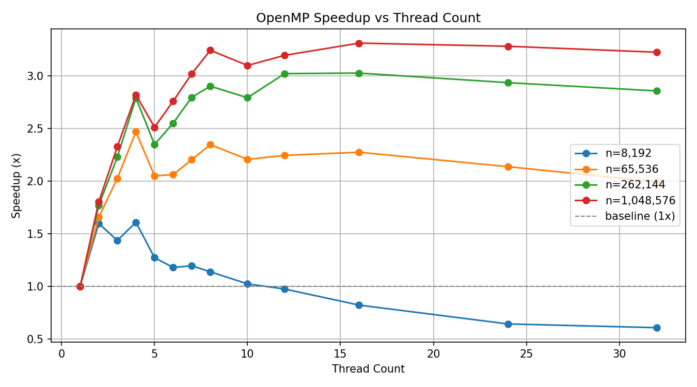
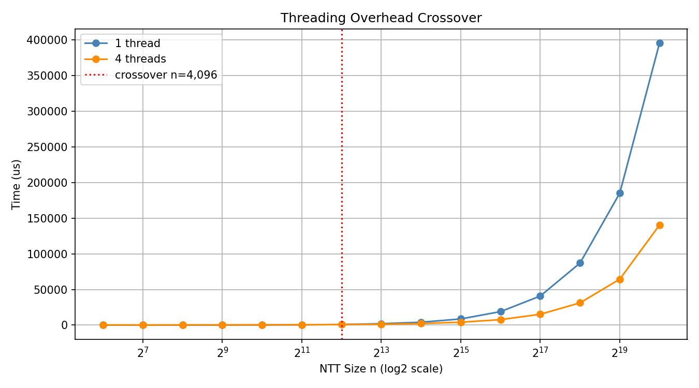
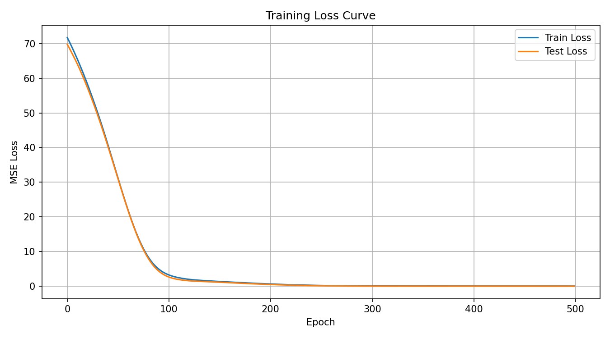
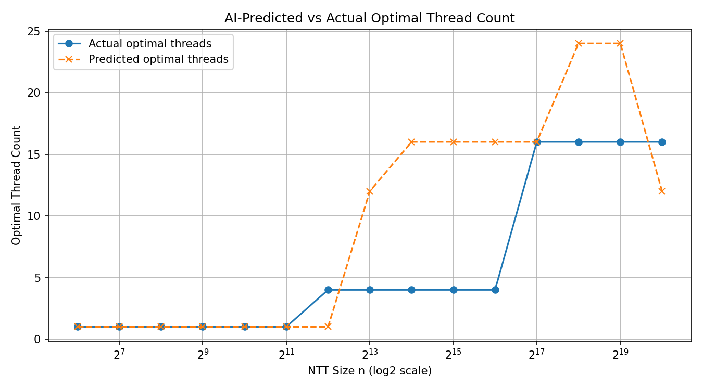
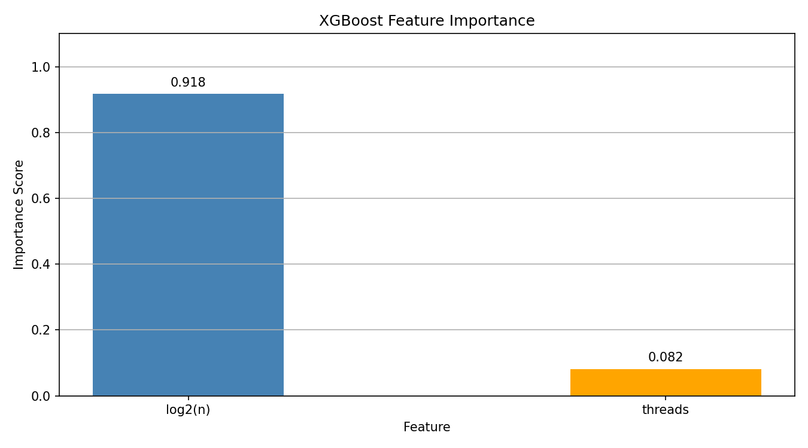
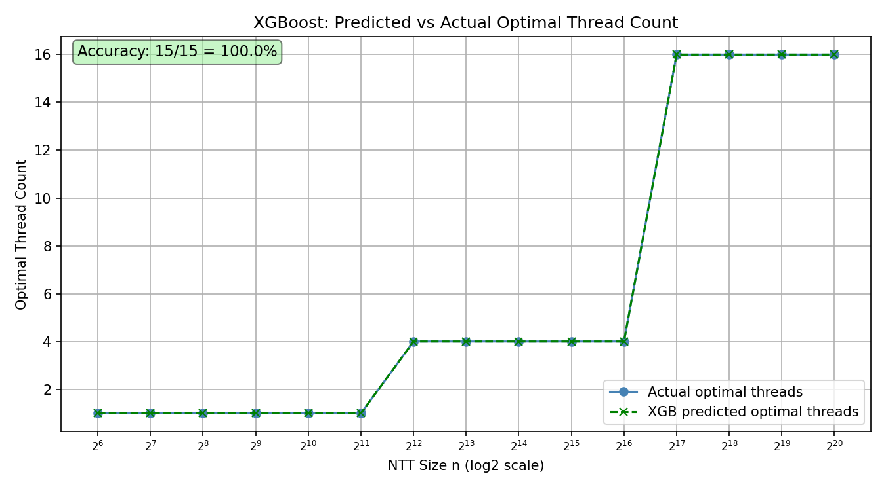
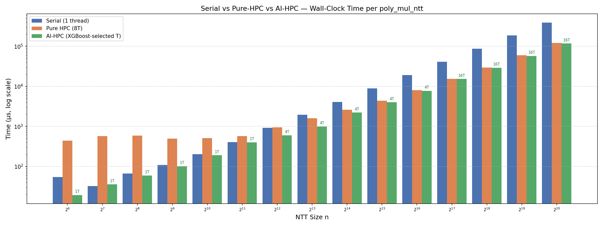
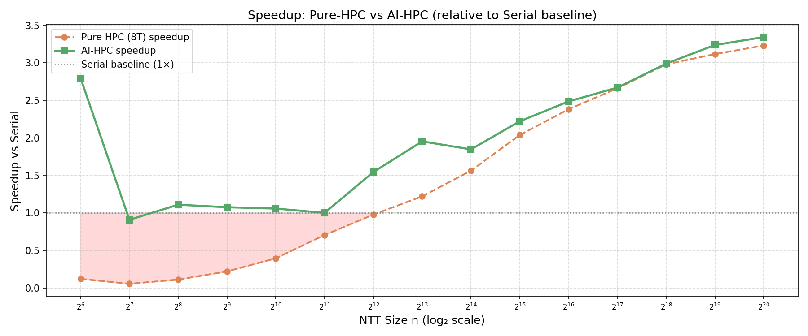

# NTT-AI-HPC

A hybrid HPC and machine learning project that accelerates Number Theoretic Transforms using OpenMP parallelism and a learned cost model that predicts the optimal thread configuration for a given input size.

**Course:** High Performance Computing (CS5013)
**Author:** R. Abinav (ME23B1004)

---

## What is the Number Theoretic Transform

The Number Theoretic Transform is the modular arithmetic equivalent of the Fast Fourier Transform. Where the FFT works over complex numbers, the NTT works entirely over integers modulo a prime. This means there are no floating point numbers involved and no rounding errors — the results are exact.

The core use of the NTT is fast polynomial multiplication. Multiplying two polynomials of degree n naively takes O(n^2) operations. Using the NTT, you transform both polynomials into the frequency domain, multiply them pointwise (O(n)), and transform the result back. The total cost is O(n log n). The NTT makes this possible while keeping all arithmetic exact, which is a hard requirement in cryptography.

This project uses the prime P = 7340033 = 7 x 2^20 + 1, which is chosen specifically because it supports NTT sizes up to 2^20 and has the right mathematical structure (P - 1 is divisible by large powers of 2, which is required to find the roots of unity the algorithm needs).

---

## How NTT is Used in ZK Systems

Zero-knowledge proof systems like STARKs and SNARKs require a prover to demonstrate knowledge of some computation without revealing the underlying data. The proof generation process involves a large amount of polynomial arithmetic over finite fields.

Specifically, proof systems such as those used in zkSync, StarkNet, and Polygon heavily rely on operations like:

- Polynomial commitment schemes, where a polynomial is evaluated at many points
- The Fast Reed-Solomon IOP of Proximity (FRI) protocol, which forms the core of STARK proofs
- Multi-scalar multiplication and polynomial division, both of which reduce to NTT operations internally

In practice, NTTs are called thousands of times during a single proof generation. A zkEVM (a zero-knowledge Ethereum Virtual Machine) that processes a batch of transactions might run millions of NTT operations per second under load. This makes NTT performance directly responsible for proof latency and throughput.

The NTT is therefore not a peripheral concern in ZK systems — it is the bottleneck. Speeding it up directly reduces proof generation time, which is currently one of the main practical barriers to deploying ZK technology at scale.

---

## Why OpenMP

The NTT butterfly computation has a naturally parallel structure. At each stage of the algorithm, the input array is split into independent groups of elements, and each group is processed without any dependency on the others. This makes it straightforward to distribute the work across CPU cores.

OpenMP was chosen for the following reasons:

**It requires minimal code change.** The parallel regions are added with a single pragma directive above the loop. The serial code path is preserved exactly — if OpenMP is not available, the compiler ignores the pragma and the code runs correctly in serial. There is no restructuring of the algorithm.

**It targets the CPU directly.** GPU acceleration (CUDA, OpenCL) requires significant infrastructure: data transfers between host and device, kernel launch overhead, and a different programming model. For a research prototype exploring the interplay between parallelism and an AI cost model, OpenMP gives clean and measurable results on the machine where the benchmark is actually run.

**Thread overhead is real and measurable.** For small NTT sizes, spawning threads costs more than the computation itself. This overhead is visible in the benchmark data and is exactly the problem that the AI cost model is designed to solve. OpenMP makes this tradeoff explicit and controllable via a thread count parameter.

---

## Why a Learned Cost Model

The naive approach to parallelism is to always use the maximum number of available threads. The benchmark data shows this is wrong. For NTT sizes below a few thousand elements, running with 8 or 16 threads is several times slower than running with 1 thread. The crossover point where more threads becomes beneficial depends on the input size, the machine's core count, and cache behavior.

A static rule like "use 4 threads if n > 8192" works for one machine but breaks on another. Autotuning systems like TVM solve this by training a model to predict the runtime of a computation given a configuration, then selecting the configuration with the lowest predicted cost. This project follows the same approach at a small scale.

The MLP (Multi-Layer Perceptron) is trained on benchmark measurements across all combinations of NTT size and thread count. Given a new NTT size, the model scores all candidate thread counts and recommends the one predicted to be fastest. The key design decisions are:

**The model predicts runtime, not the thread count directly.** This is deliberate. Predicting runtime is a regression problem with smooth structure — larger n takes longer, more threads helps up to a point. Predicting optimal thread count directly is a classification problem with arbitrary-looking labels. The regression formulation generalizes better.

**log2(n) is used as the feature, not n.** NTT sizes span four orders of magnitude (64 to 1048576). Using raw n would make the feature scale dominate the model's behavior. log2(n) distributes the sizes evenly and reflects the actual computational scaling of the algorithm.

**log1p(time_us) is used as the target.** Raw microsecond values also span four orders of magnitude. MSE on raw values would be completely dominated by the large-n cases and the model would learn nothing useful about small n. The log transform compresses the range and gives the model balanced signal across all sizes.

---

## Codebase Architecture

```
ntt-ai-hpc/
|
|-- src/
|   |-- core/
|   |   |-- ntt.h          Public API — function declarations and doc comments
|   |   |-- ntt.cpp        Implementation — all NTT and modular arithmetic logic
|   |-- main.cpp            Demo program — runs forward/inverse NTT and poly multiply with timing
|
|-- tests/
|   |-- test_ntt.cpp        8 correctness tests covering modular arithmetic, round-trips, and poly multiply
|
|-- benchmarks/
|   |-- bench_ntt.cpp       Benchmark sweep across NTT sizes and thread counts, CSV output to stdout
|
|-- python/
|   |-- requirements.txt    Python dependencies (numpy, flask, torch)
|   |-- ntt_ai_book.ipynb   Jupyter notebook — data analysis, plots, MLP training
|   |-- api/
|       |-- app.py          Flask API serving the trained cost model
|       |-- test_api.py     Script to smoke-test all API endpoints
|       |-- cost_model.pt   Trained MLP weights (saved by the notebook)
|       |-- scaler.pkl      Fitted StandardScaler (saved by the notebook)
|
|-- results/
|   |-- result.csv          Benchmark output used for model training
|
|-- scripts/
|   |-- build.sh            Configures and builds all targets via CMake
|
|-- CMakeLists.txt          Build system — defines ntt_core, ntt_main, ntt_test, bench_ntt
```

### C++ layer

The NTT core is built as a static library (`libntt_core.a`). The public interface in `ntt.h` exposes five functions: `ntt_forward`, `ntt_inverse`, `poly_mul_ntt`, and two modular arithmetic helpers. All three transform functions accept a `thread_count` parameter (default 0, meaning use the OpenMP runtime default). When compiled without OpenMP, the parameter is ignored and the code runs serially.

The butterfly loops in `ntt_forward` are parallelized across independent groups using `#pragma omp parallel for`. The pointwise multiply loop in `poly_mul_ntt` and the scaling loop in `ntt_inverse` are similarly parallelized. All parallel regions are guarded with `#ifdef _OPENMP` so the serial fallback is unconditional.

### Benchmark layer

`bench_ntt.cpp` sweeps NTT sizes from 64 to 1048576 and thread counts from 1 to 32. For each combination it runs `poly_mul_ntt` five times and records the median wall-clock time in microseconds. Output is CSV to stdout, which is redirected to `results/result.csv`.

### Python layer

The Jupyter notebook (`ntt_ai_book.ipynb`) loads the benchmark CSV, produces three plots (speedup curve, crossover chart, predicted vs actual thread count), trains the MLP cost model, and saves the weights and scaler to `python/api/`.

The Flask API (`app.py`) loads the model and scaler once at startup. It exposes three endpoints: `/health` for a liveness check, `/predict` which takes an NTT size and returns the recommended thread count along with predicted times for all candidates, and `/optimal_map` which returns the full recommendation table for all supported sizes.

---

## Building and Running

Requires CMake >= 3.16 and a C++17 compiler. On macOS with Apple Clang, install libomp via Homebrew to enable OpenMP.

```bash
# install libomp (macOS only)
brew install libomp

# build all targets
bash scripts/build.sh

# run the demo
./build/ntt_main

# run the 8 correctness tests
./build/ntt_test

# run the benchmark and save results
./build/bench_ntt 2>/dev/null > results/result.csv
```

For the Python layer:

```bash
pip install -r python/requirements.txt

# open the notebook to train the model
jupyter notebook python/ntt_ai_book.ipynb

# start the API server
python python/api/app.py

# in a second terminal, run the smoke tests
python python/api/test_api.py
```

---

## Outputs

### Speedup Curve

Shows how much faster the parallel NTT is compared to the single-threaded baseline, for four large input sizes. For n=1,048,576 the transform runs around 3.3x faster at the sweet spot. For n=8,192 the overhead of spawning threads outweighs the benefit at higher thread counts, pulling speedup below 1x.



### Threading Overhead Crossover

Plots raw wall-clock time for 1 thread vs 4 threads across all NTT sizes. The two lines cross at n=4,096 — to the left of that point, 1 thread is faster; to the right, 4 threads wins. This crossover is why a fixed thread count is the wrong approach and why the cost model is needed.



### Training Loss Curve

MSE loss on log1p(time_us) for the MLP over 500 epochs. Train and test loss track each other closely throughout, which means the model is not overfitting — it generalises to unseen (n, threads) combinations. Loss drops from around 71 at epoch 0 to near 0 by epoch 300.



### AI-Predicted vs Actual Optimal Thread Count

For each NTT size in the held-out test set, the model scores all 13 candidate thread counts and picks the one with the lowest predicted runtime. That prediction is plotted against the ground truth from the benchmark. The model correctly learns the two main regimes: use 1 thread for small n, and scale up threads for large n. Exact-match accuracy on the test set is 46.7%.



### XGBoost Feature Importance

Shows which input feature the XGBoost cost model relies on most heavily. log2(n) accounts
for 91.8% of the model's decision — the NTT size almost entirely determines the optimal
thread count. The thread count feature contributes only 8.2%, confirming that the model
learned to use threads as a scoring axis, not a primary signal.



### XGBoost: Predicted vs Actual Optimal Thread Count

XGBoost is evaluated on all 15 NTT sizes. The predicted and actual lines overlap exactly —
100% exact-match accuracy across the full size range. XGBoost outperforms the MLP (66.7%)
because the optimal thread count is a step function of n with sharp boundaries at n=4,096
and n=131,072. Gradient boosted trees naturally represent step-function boundaries via
axis-aligned splits, while the MLP smooths over them. For this problem — tabular input,
sharp regime boundaries, small dataset — XGBoost is the better model and is set as the
default in the Flask API.



---

## Three-Way Performance Comparison: Serial vs Pure-HPC vs AI-HPC

The core claim of this project is that blindly using maximum threads is not optimal. This comparison runs the same `poly_mul_ntt` across all NTT sizes three ways:

- **Serial** — 1 thread, no parallelism
- **Pure HPC** — maximum available threads (OpenMP default)
- **AI-HPC** — thread count selected by the XGBoost cost model at runtime

### Wall-Clock Time (all sizes)

For small NTT sizes, Pure HPC is up to 17x slower than serial due to thread spawn overhead. AI-HPC avoids this by selecting 1 thread for small n. At the crossover (n=4096), AI-HPC picks 4 threads and achieves 1.55x speedup while Pure HPC is still below serial. At large n, both converge — but AI-HPC never regresses.



### Speedup vs Serial Baseline

The red-shaded zone shows where Pure HPC is actually slower than a single thread. AI-HPC stays above the baseline across the entire size range.



### Key numbers

| n | Serial (µs) | Pure HPC (µs) | AI-HPC (µs) | AI threads | AI Speedup |
|---|---|---|---|---|---|
| 64 | 53.8 | 440.5 | 19.2 | 1 | 2.80x |
| 4096 | 923.2 | 943.7 | 597.1 | 4 | 1.55x |
| 65536 | 19194.0 | 8055.6 | 7720.0 | 4 | 2.49x |
| 1048576 | 392771.0 | 121531.0 | 117444.0 | 16 | 3.34x |

Full results: [`results/comparison.csv`](results/comparison.csv)
---

## References

- CRYSTALS-Kyber: https://github.com/pq-crystals/kyber
- CRYSTALS-Dilithium: https://github.com/pq-crystals/dilithium
- Icicle (GPU NTT): https://github.com/ingonyama-zk/icicle
- TVM learned cost model: https://tvm.apache.org/docs/reference/api/python/auto_scheduler.html